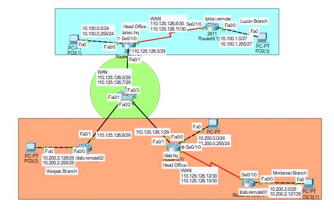

# 📡 Static Routing Lab - I.T Lab Corporation Network Expansion

This project simulates a nationwide enterprise network expansion for I.T Lab Corporation, a fast-growing tech solutions provider in the Philippines. The lab focuses on configuring static routing to enable secure and efficient communication between the company’s Head Office and newly opened branches in Luzon, Visayas, and Mindanao.

##  Project Goals
- Enable seamless communication between all branch offices and head office subnets.
- Manually configure static routes on routers without dynamic routing protocols.
- Apply subnetting and route summarization(if possible) to simplify routing tables.
- Simulate real-world enterprise WAN interconnectivity in a controlled lab environment.
- Assumed that VPN tunnels or private WAN links have already been successfully established between all branch routers. This ensures secure communication across locations.

##  My Responsibilities
- Designed IP addressing and subnetting for all branch networks.
- Configured static routes on all routers using next-hop addressing or exit interfaces.
- Applied route summarization techniques to reduce routing table size.
- Built and tested the full topology in Cisco Packet Tracer.
- Verified network connectivity using ping and traceroute.

## Technical Skills Applied
- Static Routing	Manually configured static routes for all inter-branch communication.
- Subnetting	Designed efficient subnet schemes for branch offices using /24, /25, /27 masks.
- Network Simulation	Built and tested a multi-branch WAN setup using Cisco Packet Tracer.
- Troubleshooting	Performed connectivity tests and route verification (ping, traceroute).

## 🗺️ Networks LAN Subnets
| Location            | Router Name        | LAN Subnet             |
|---------------------|--------------------|------------------------|
| Head Office 1       | lpltsc.hq          | 10.100.0.0/24          |
| Head Office 2       | itlab.hq           | 10.200.0.0/24          |
| Luzon Branch        | ipltsc.remote      | 10.100.1.0/27          |
| Mindanao Branch     | itlab.remote01     | 10.200.2.0/25          |
| Visayas Branch      | itlab.remote02     | 10.200.2.128/25        |

## 🗺️ WAN Subnets (VPN/WAN Links)
| Link                            | WAN Subnet       |
| ------------------------------- | ---------------- |
| HQ (lpltsc.hq) ↔ Luzon Branch   | 110.125.126.8/30 |
| HQ (itlab.hq) ↔ Mindanao Branch | 110.125.126.12/30|
| HQ (itlab.hq) ↔ Visayas Branch  | 110.125.126.0/29 |

📥 [Download the Packet Tracer Lab File (.pkt)](lab-files/Static-Routing-Lab.pkt)

